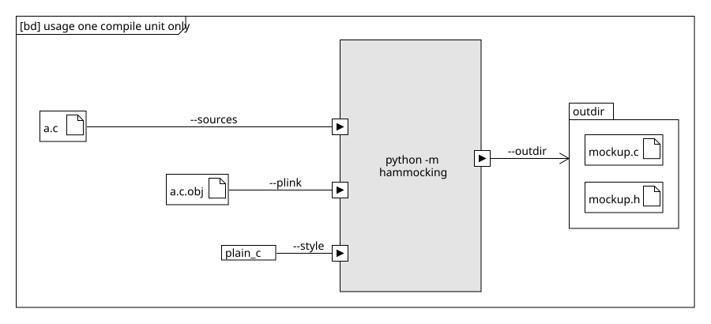
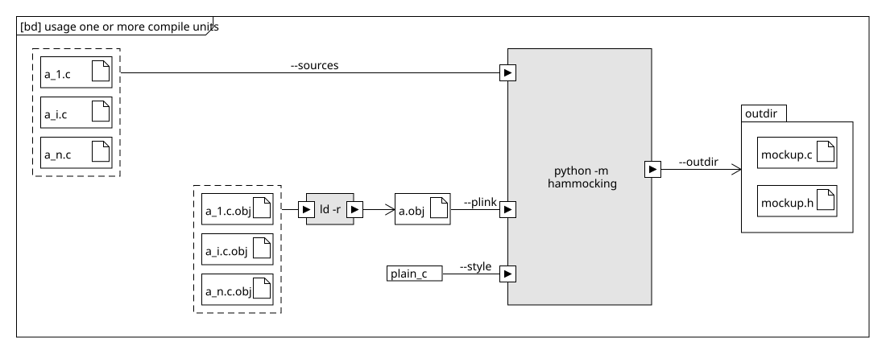

# Usage

## Command line

Before we integrate it into the build chain of your choice it is a good idea to call it on the command line
in order to gather more understanding what it does and what it needs.

Let's call hammocking without any arguments:

```shell
$ python -m hammocking
usage: hammocking [-h] (--symbols SYMBOLS [SYMBOLS ...] | --plink PLINK) --outdir OUTDIR --sources SOURCES [SOURCES ...] [--except EXCLUDES ...]
hammocking: error: the following arguments are required: --outdir/-o, --sources
```

hammocking needs ...

* *--sources*: The list of paths to source files which represent your item-under test. (In classic unittest it is just one)
* Either ...
   * --symbols*: comma separated list of symbol names which are to mock or
   * *--plink*: path to the object file which contains the unresolved symbols to mock
* *--outdir*: An existing directory where to write code files containing mockup code.
* *--except*: if a symbol is found in a header of these directories, it will not be mocked. Use this to exclude symbols from mocking that will be provided by libraries in the linking process.
  (Defaults to `/usr/include` for system headers)

## One compilation unit

We show this scenario for explanation purpose only. The next chapter shows the common way and covers the one compilation unit as well.

In a simple scenario your



### Make

```makefile
# See usage/examples/one_compile_unit/Makefile
```

### CMake

## One or more compilation units



### Make

```makefile
# See usage/examples/one_or_more_compile_units/Makefile
```

### CMake

## Usage with GoogleTest and GoogleMocks

https://google.github.io/googletest/reference/mocking.html

```cmake
# See tests/data/mini_c_test/CMakeLists.txt
```

## Exclude Symbols not found in the project-root-directory

If you want to exclude all symbols that are found outside of your project root directory, you can use the
*--ignore-symbols-outside-project* option. This is useful to exclude symbols that are provided by the standard libraries. To use this option, you need to additionally specify the project root directory with the *---project-root-dir* option.

## Overwrite hammocking default parameters

You can overwrite the default parameters of hammocking by creating a file named `hammocking.ini` in the current working directory. The file should contain the parameters you want to overwrite, in the format:

```ini
[hammocking]
parameter = value
[hammocking.<system>]
parameter = value
```

The system depends on the platform you are running on, e.g. `hammocking.linux` for Linux systems. The parameters you can overwrite are:

* clang_lib_file
* clang_lib_path
* ignore_path
* exclude_pattern
* include_pattern
* nm_path

If you have created the file you can run hammocking with the `--config` option to specify the path to the configuration file.

Each of these parameters can also be set via command line option. The command line options have precedence over the parameters in the configuration file.
Please be aware that the `ignore_path` parameter from the configuration file is called `exclude_paths` in the command line options.
